# Central Spanning Tree

This repository includes the code of the experiments conducted in the paper "The Central Spanning Tree" by Enrique 
Fita Sanmartin, Christoph Schnörr and Fred A. Hamprecht. The paper is available [here](https://arxiv.org/pdf/2404.06447.pdf).

## Usage
The code is written in Python 3.8. To install the required packages, run the following command:
#### Install the required packages
```bash
pip install -r requirements.txt
```

#### Example
```
import numpy as np

#if Not installed
from lib.CST.T_datacls.T_datacls import T_data

# if installed 
# from CST.T_datacls.T_datacls import T_data


# Generate random data
n = 100
np.random.seed(0)
P = np.random.rand(n, 2)

# Create the T_data object
tdata = T_data(P)

# Compute the CST and BCST
alpha=0.5

tdata.compute_BCST(alpha=alpha, maxiter_mSTreg=10, return_topo_CST=True,verbose=False)

print(tdata.trees['CST_%0.2f' % alpha])
print(tdata.trees['BCST_%0.2f' % alpha])
```


## Definition
The Central Spanning Tree (CST) is a family of robust spanning trees embedded in Euclidean space, whose geometrical 
structure is resilient against perturbations such as noise on the coordinates of the nodes. Two variants of the 
problem are explored: one permitting the inclusion of Steiner points (referred to as branched central spanning tree 
or BCST), and another that does not. The family of trees is defined through a parameterized NP-hard minimization 
problem over the edge lengths, with specific instances including the minimum spanning tree or the Euclidean Steiner 
tree. The minimization problem weighs the length of the edges by their tree edge-centralities, which are regulated 
by a parameter $\alpha$. Formally, the CST is defined as the solution to the following optimization problem:

$$\underset{T}{\arg \min}\sum_{(i,j)\in E_{T}}\big(m_{ij}(1-m_{ij})\big)^{\alpha}||x_i-x_j||$$

where $m_{ij}$ and $(1-m_{ij})$ are the normalized cardinalities of the components resulting from the removal of the edge 
$e=(i,j)$ from $T$. the product $m_e(1-m_e)$ is proportional to the "edge betweeness centrality" of $e$ in $T$.

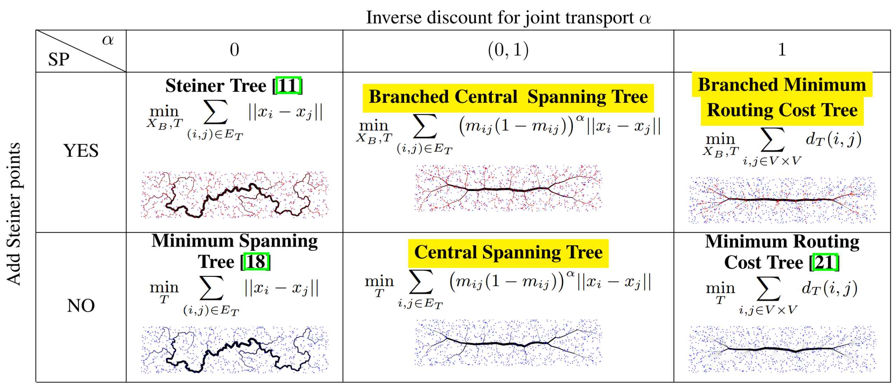

[11]: Gilbert et. al.: Steiner Minimal Trees (1968)

[18]: Kruskal: On the Shortest Spanning Subtree of a Graph and the Traveling Salesman Problem (1956)

[21]: Masone et. al.: The minimum routing cost tree problem: State of the art and a core-node based heuristic algorithm (2019)

## Evolution (Branched) Central Spanning Tree with respect to α

| CST                                                                   | BCST                                                                   |
|-----------------------------------------------------------------------|------------------------------------------------------------------------|
| 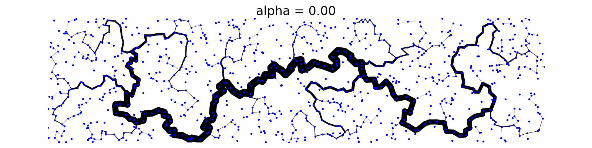 | 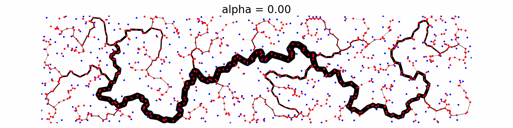 |


## Stability
As $\alpha$ increases the CST becomes more stable against perturbations in the coordinates of the nodes at the 
expense of having larger edges. The parameter $\alpha$ can be interpreted as a trade-off between the stability of 
the tree and the data fidelity, where the latter is intuitively related to connecting the nodes with short edges. 

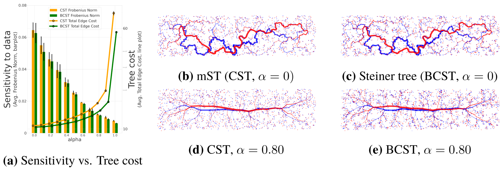 

|                               CST                               |                               BCST                                |
|:---------------------------------------------------------------:|:-----------------------------------------------------------------:|
|                             α=0.00                              |                              α=0.00                               |
| 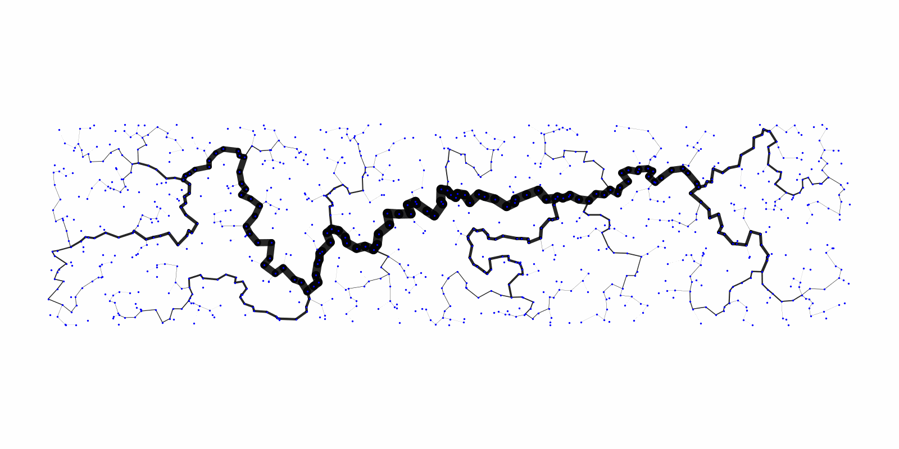 | 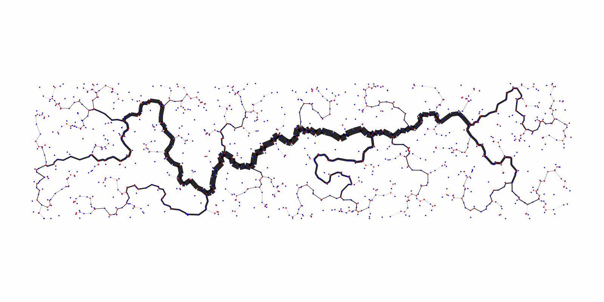  |
|                             α=0.25                              |                              α=0.25                               |
| 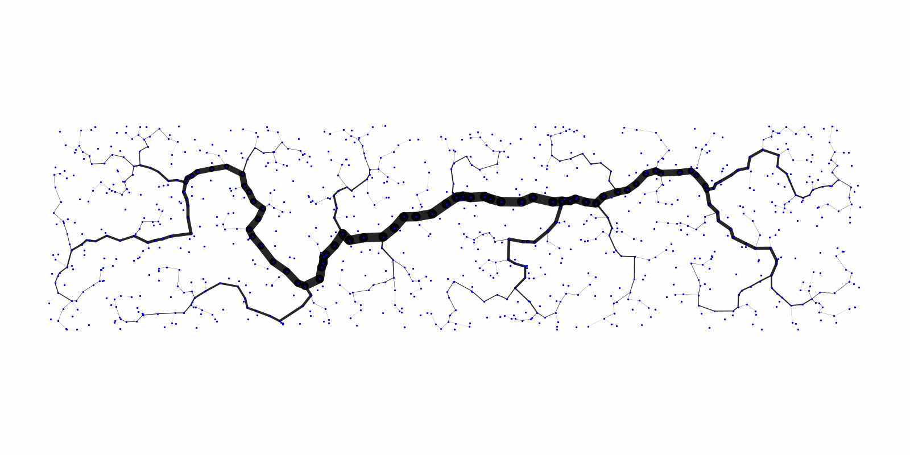 | 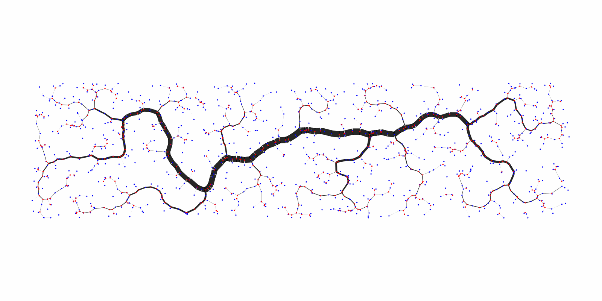  |
|                             α=0.50                              |                              α=0.50                               |
| 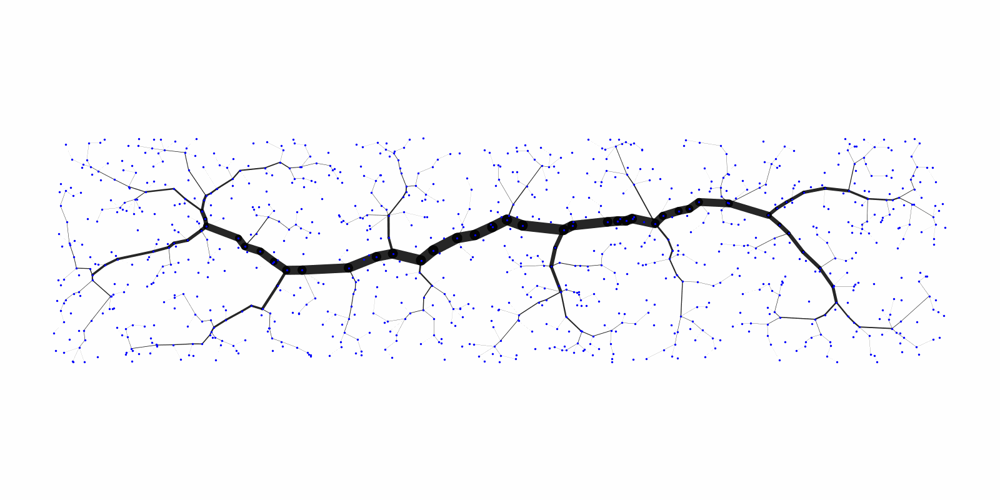 | 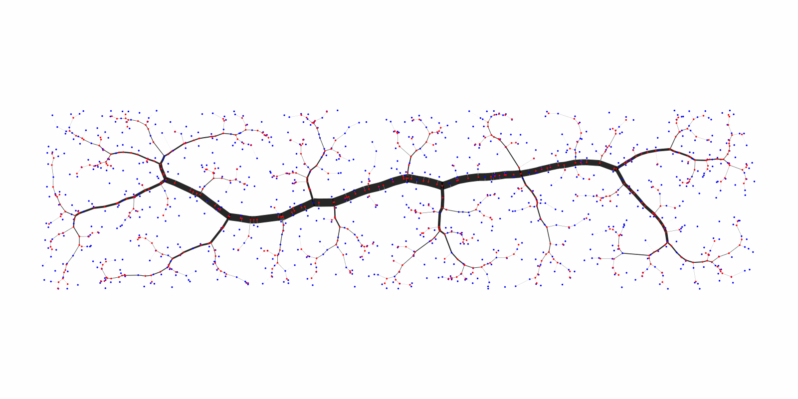  |
|                             α=0.75                              |                              α=0.75                               |
| 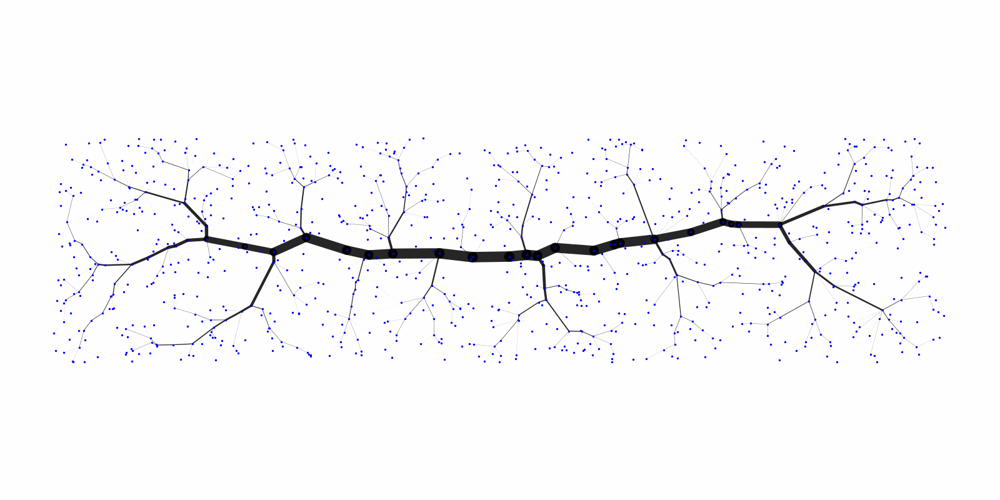 | 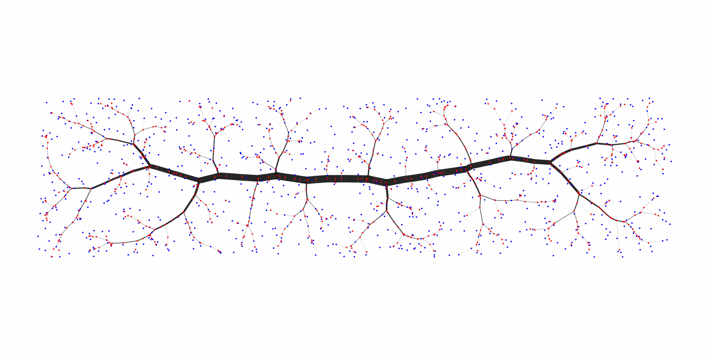  |
|                             α=1.00                              |                              α=1.00                               |
| 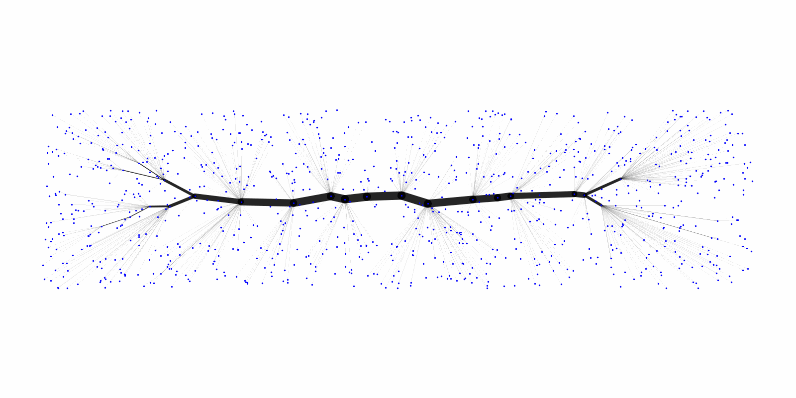 | 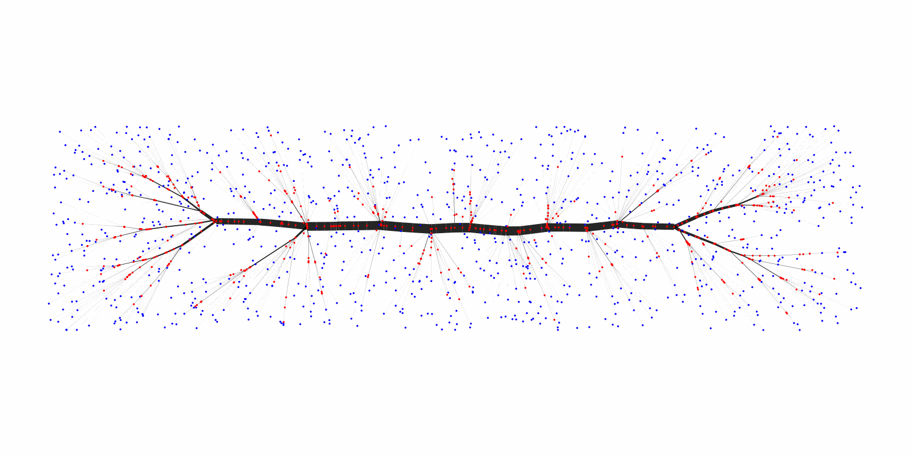 |

## mSTreg algorithm

The central spanning tree is a NP-hard problem. It is known that BCST topology can be represented by a so called 
full topology, which is a tree that contains all input nodes (terminals) as leaves and all Steiner points have 
degree 3. 
To approximate the solution, we propose a heuristic algorithm called mSTreg, which alternates between two steps:
- **Geometry update**: It updates the coordinates of the Steiner points. Given a topology, the optimal position of the 
  coordinates can be computed efficiently.
- **Topology update**: It updates the topology of the tree. Given the coordinates of the nodes and the optimal Steiner 
  point coordinates of the previous step, it updates the topology of the tree, by computing the minimum spanning 
  tree (mST) over all nodes (Steiner and terminal nodes). The mST is then transformed into a full topology since we 
  know that the optimal topology is a full topology.

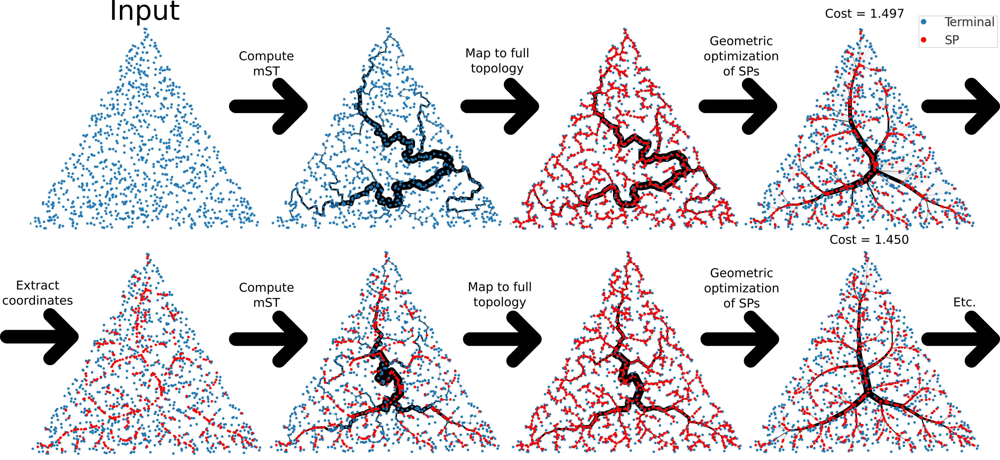


## Iterations of the mSTreg algorithm
| α = 0.25 | α = 0.50 |
|--------------|--------------|
| 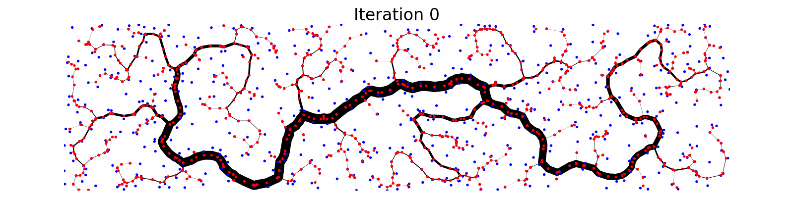 | 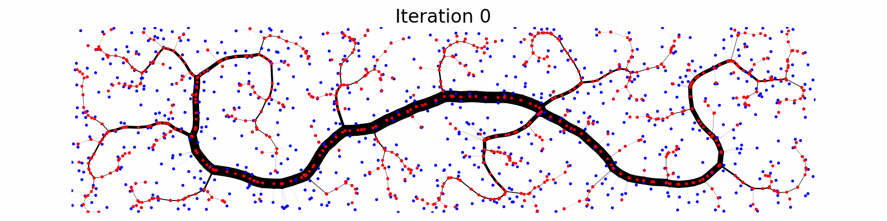 |

| α = 0.75 | α = 1.00 |
|--------------|--------------|
| 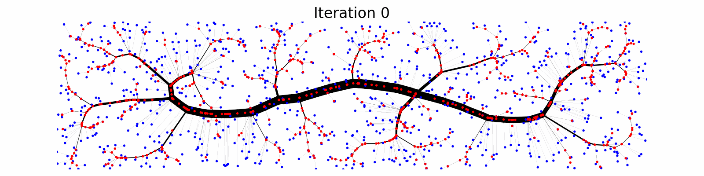 | 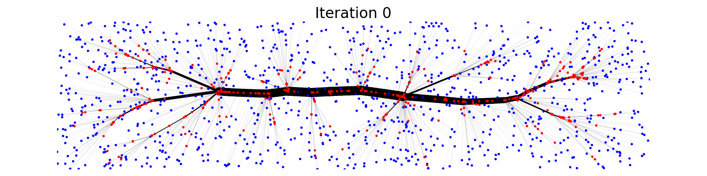 |


[//]: # (## 3D Plant skeletonization)

[//]: # (### Tomato plant 2, Day 5)

[//]: # (| BCST  α = 0.00                                                                                     | BCST  α = 0.50                                                                                           | BCST  α = 0.70                                                                                           | BCST  α = 1.00                                                                                           |)

[//]: # (|----------------------------------------------------------------------------------------------------|----------------------------------------------------------------------------------------------------------|----------------------------------------------------------------------------------------------------------|----------------------------------------------------------------------------------------------------------|)

[//]: # (| ![Figure 1]&#40;./Figures/GIFS/plant_skeleton/tomato_plant2/n=5000/tomato_plant2_day5_n=5000_BCST_0.00.gif&#41; | ![Figure 2]&#40;./Figures/GIFS/plant_skeleton/tomato_plant2/n=5000/tomato_plant2_day5_n=5000_BCST_0.50.gif&#41; | ![Figure 3]&#40;./Figures/GIFS/plant_skeleton/tomato_plant2/n=5000/tomato_plant2_day5_n=5000_BCST_0.70.gif&#41; | ![Figure 4]&#40;./Figures/GIFS/plant_skeleton/tomato_plant2/n=5000/tomato_plant2_day5_n=5000_BCST_1.00.gif&#41; |       )

[//]: # ()
[//]: # ()
[//]: # (### Tomato plant 2, Day 8)

[//]: # (| BCST  α = 0.00                                                                                     | BCST  α = 0.50                                                                                           | BCST  α = 0.70                                                                                           | BCST  α = 1.00                                                                                           |)

[//]: # (|----------------------------------------------------------------------------------------------------|----------------------------------------------------------------------------------------------------------|----------------------------------------------------------------------------------------------------------|----------------------------------------------------------------------------------------------------------|)

[//]: # (| ![Figure 1]&#40;./Figures/GIFS/plant_skeleton/tomato_plant2/n=5000/tomato_plant2_day8_n=5000_BCST_0.00.gif&#41; | ![Figure 2]&#40;./Figures/GIFS/plant_skeleton/tomato_plant2/n=5000/tomato_plant2_day8_n=5000_BCST_0.50.gif&#41; | ![Figure 3]&#40;./Figures/GIFS/plant_skeleton/tomato_plant2/n=5000/tomato_plant2_day8_n=5000_BCST_0.70.gif&#41; | ![Figure 4]&#40;./Figures/GIFS/plant_skeleton/tomato_plant2/n=5000/tomato_plant2_day8_n=5000_BCST_1.00.gif&#41; |       )

[//]: # ()
[//]: # ()
[//]: # (### Tomato plant 2, Day 13)

[//]: # (| BCST  α = 0.00                                                                                      | BCST  α = 0.50                                                                                            | BCST  α = 0.70                                                                                            | BCST  α = 1.00                                                                                      |)

[//]: # (|-----------------------------------------------------------------------------------------------------|-----------------------------------------------------------------------------------------------------------|-----------------------------------------------------------------------------------------------------------|-----------------------------------------------------------------------------------------------------|)

[//]: # (| ![Figure 1]&#40;./Figures/GIFS/plant_skeleton/tomato_plant2/n=5000/tomato_plant2_day13_n=5000_BCST_0.00.gif&#41; | ![Figure 2]&#40;./Figures/GIFS/plant_skeleton/tomato_plant2/n=5000/tomato_plant2_day13_n=5000_BCST_0.50.gif&#41; | ![Figure 3]&#40;./Figures/GIFS/plant_skeleton/tomato_plant2/n=5000/tomato_plant2_day13_n=5000_BCST_0.70.gif&#41; | ![Figure 4]&#40;./Figures/GIFS/plant_skeleton/tomato_plant2/n=5000/tomato_plant2_day13_n=5000_BCST_1.00.gif&#41; |       )


## 3D Plant skeletonization 
### Tomato plant 2, Day 5
| BCST  α = 0.00                                                                                     | BCST  α = 0.50                                                                                           | BCST  α = 0.70                                                                                           | BCST  α = 1.00                                                                                           |
|----------------------------------------------------------------------------------------------------|----------------------------------------------------------------------------------------------------------|----------------------------------------------------------------------------------------------------------|----------------------------------------------------------------------------------------------------------|
| 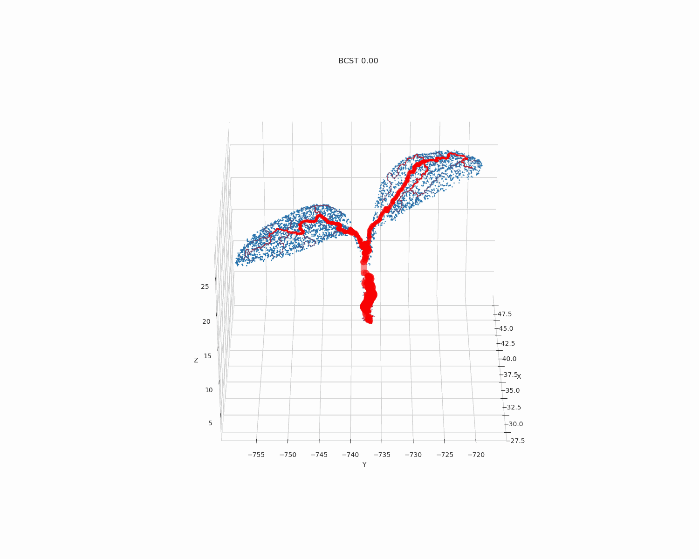 | 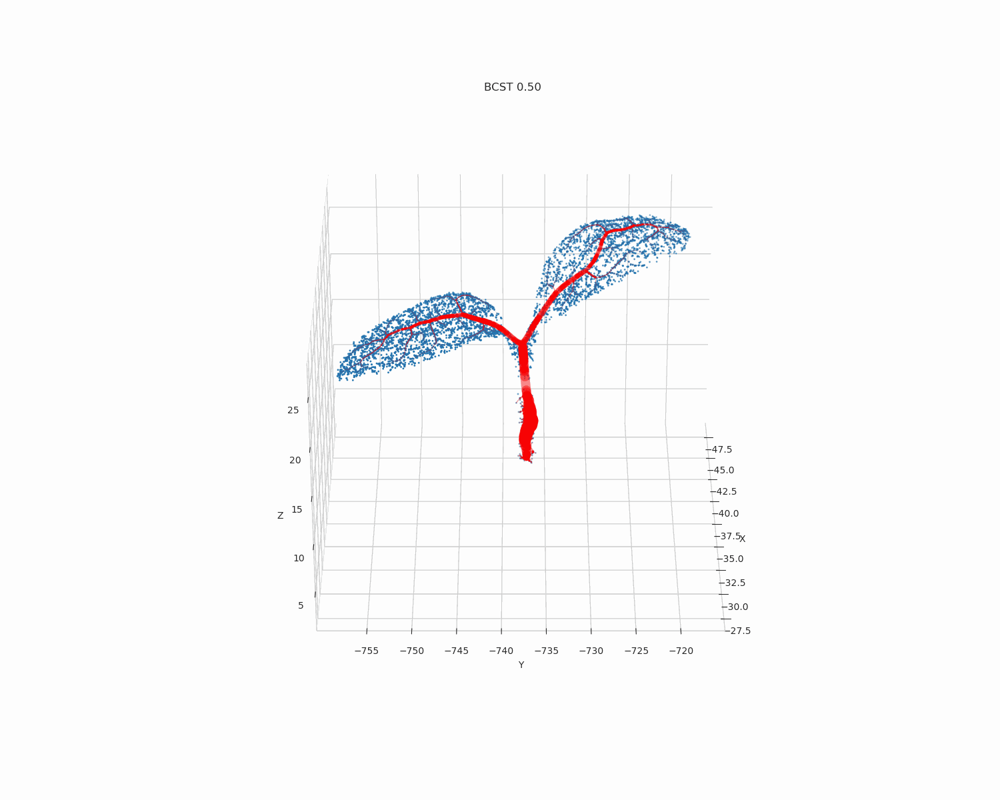 | 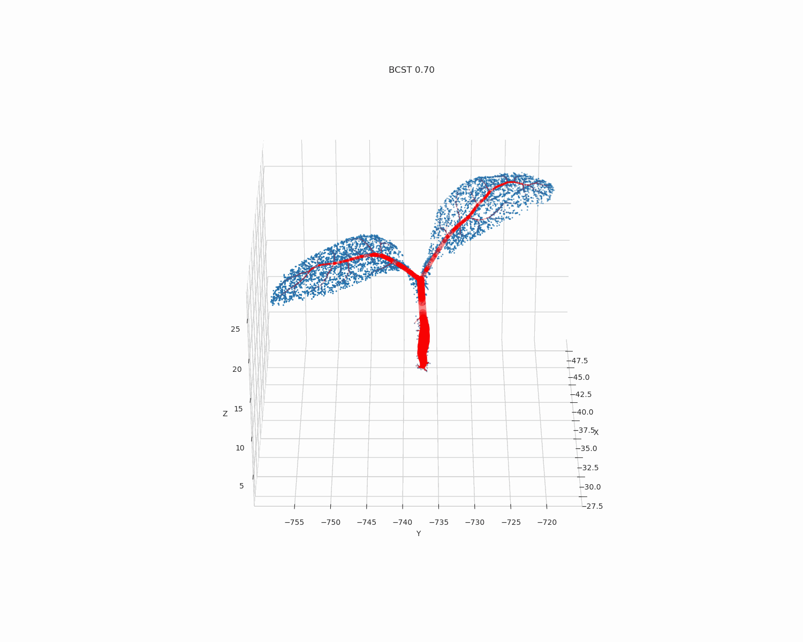 | 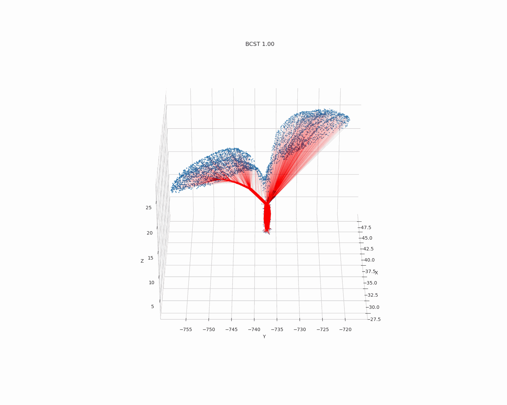 |       


### Tomato plant 2, Day 8
| BCST  α = 0.00                                                                                     | BCST  α = 0.50                                                                                           | BCST  α = 0.70                                                                                           | BCST  α = 1.00                                                                                           |
|----------------------------------------------------------------------------------------------------|----------------------------------------------------------------------------------------------------------|----------------------------------------------------------------------------------------------------------|----------------------------------------------------------------------------------------------------------|
|  | 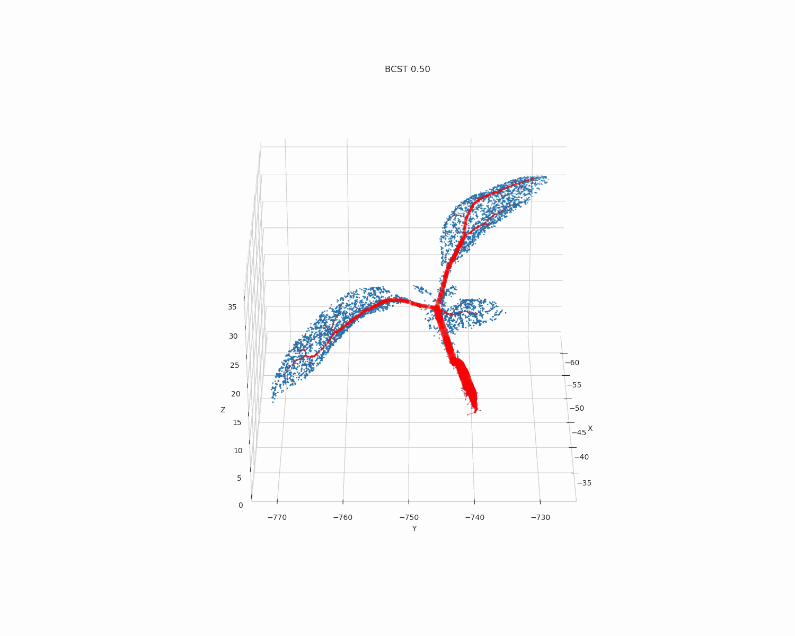 | 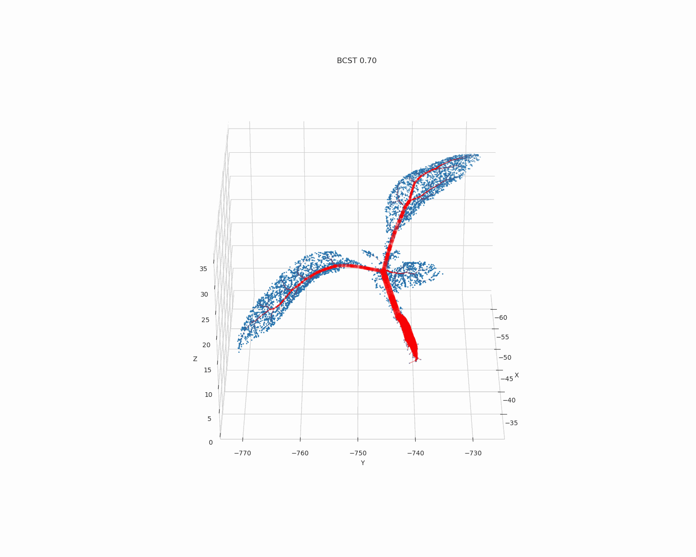 | 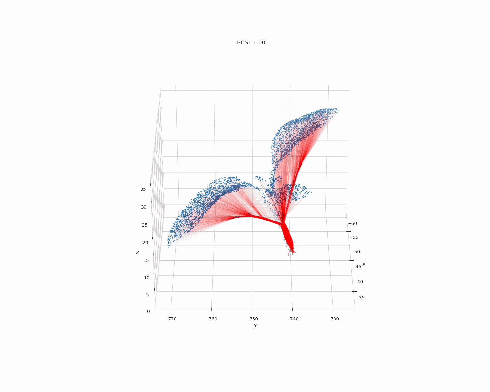 |       


### Tomato plant 2, Day 13
| BCST  α = 0.00                                                                                                 | BCST  α = 0.50                                                                                            | BCST  α = 0.70                                                                                                 | BCST  α = 1.00                                                                                            |
|----------------------------------------------------------------------------------------------------------------|-----------------------------------------------------------------------------------------------------------|----------------------------------------------------------------------------------------------------------------|-----------------------------------------------------------------------------------------------------------|
| 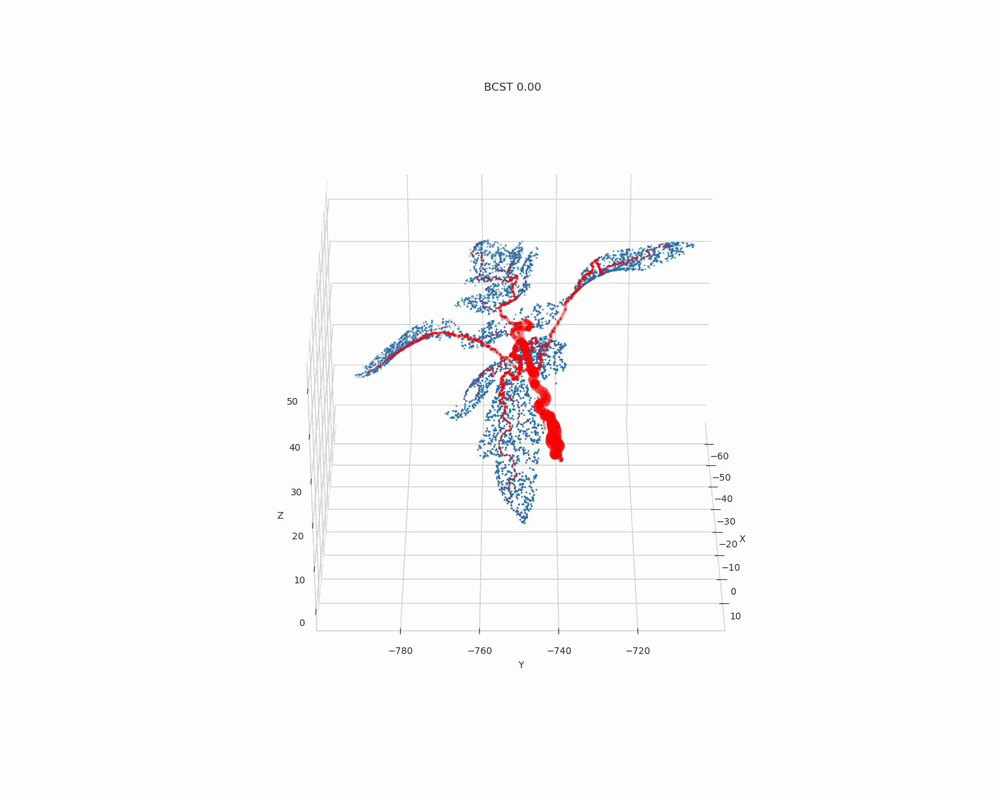 | 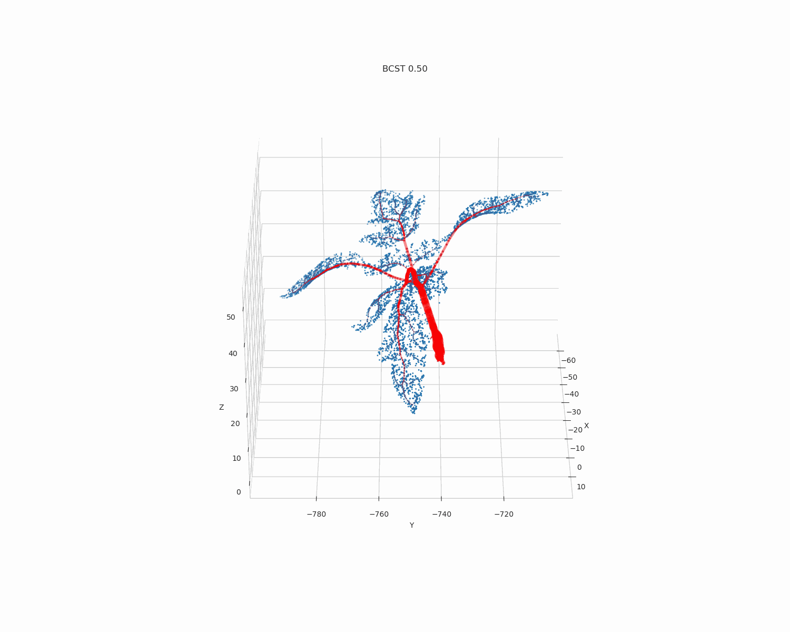 | 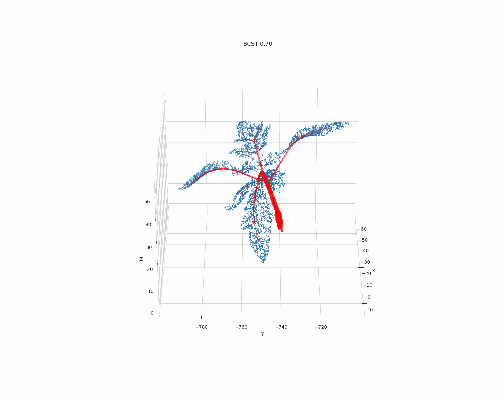 |  |       
