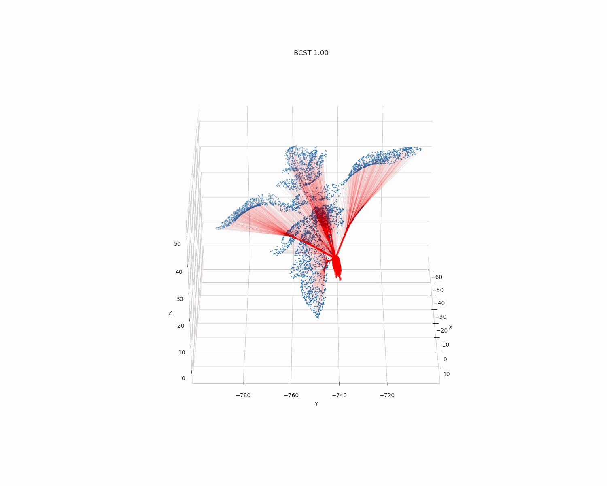

# Central Spanning Tree

#Description of your repository.

[11]: Gilbert et. al.: Steiner Minimal Trees (1968)

[18]: Kruskal: On the Shortest Spanning Subtree of a Graph and the Traveling Salesman Problem (1956)

[21]: Masone et. al.: The minimum routing cost tree problem: State of the art and a core-node based heuristic algorithm (2019)

## mSTreg algorithm

## Iterations of the mSTreg algorithm
| α = 0.25 | α = 0.50 |
|--------------|--------------|
|  |  |

| α = 0.75 | α = 1.00 |
|--------------|--------------|
|  |  |

## Evolution (Branched) Central Spanning Tree with respect to α

| CST                                                                   | BCST                                                                   |
|-----------------------------------------------------------------------|------------------------------------------------------------------------|
|  |  |

## 3D Plant skeletonization
### Tomato plant 2, Day 5
| BCST  α = 0.00                                                                                     | BCST  α = 0.50                                                                                           | BCST  α = 0.70                                                                                           | BCST  α = 1.00                                                                                           |
|----------------------------------------------------------------------------------------------------|----------------------------------------------------------------------------------------------------------|----------------------------------------------------------------------------------------------------------|----------------------------------------------------------------------------------------------------------|
|  |  |  |  |       

### Tomato plant 2, Day 8
| BCST  α = 0.00                                                                                     | BCST  α = 0.50                                                                                           | BCST  α = 0.70                                                                                           | BCST  α = 1.00                                                                                           |
|----------------------------------------------------------------------------------------------------|----------------------------------------------------------------------------------------------------------|----------------------------------------------------------------------------------------------------------|----------------------------------------------------------------------------------------------------------|
|  |  |  |  |       

### Tomato plant 2, Day 13
| BCST  α = 0.00                                                                                      | BCST  α = 0.50                                                                                            | BCST  α = 0.70                                                                                            | BCST  α = 1.00                                                                                      |
|-----------------------------------------------------------------------------------------------------|-----------------------------------------------------------------------------------------------------------|-----------------------------------------------------------------------------------------------------------|-----------------------------------------------------------------------------------------------------|
|  |  |  |  |       

## 3D Plant skeletonization prior
### Tomato plant 2, Day 5
| BCST  α = 0.00                                                                                     | BCST  α = 0.50                                                                                           | BCST  α = 0.70                                                                                           | BCST  α = 1.00                                                                                           |
|----------------------------------------------------------------------------------------------------|----------------------------------------------------------------------------------------------------------|----------------------------------------------------------------------------------------------------------|----------------------------------------------------------------------------------------------------------|
|  |  |  |  |       

### Tomato plant 2, Day 8
| BCST  α = 0.00                                                                                     | BCST  α = 0.50                                                                                           | BCST  α = 0.70                                                                                           | BCST  α = 1.00                                                                                           |
|----------------------------------------------------------------------------------------------------|----------------------------------------------------------------------------------------------------------|----------------------------------------------------------------------------------------------------------|----------------------------------------------------------------------------------------------------------|
|  |  |  |  |       

### Tomato plant 2, Day 13
| BCST  α = 0.00                                                                                                 | BCST  α = 0.50                                                                                            | BCST  α = 0.70                                                                                                 | BCST  α = 1.00                                                                                            |
|----------------------------------------------------------------------------------------------------------------|-----------------------------------------------------------------------------------------------------------|----------------------------------------------------------------------------------------------------------------|-----------------------------------------------------------------------------------------------------------|
|  |  |  |  |       
